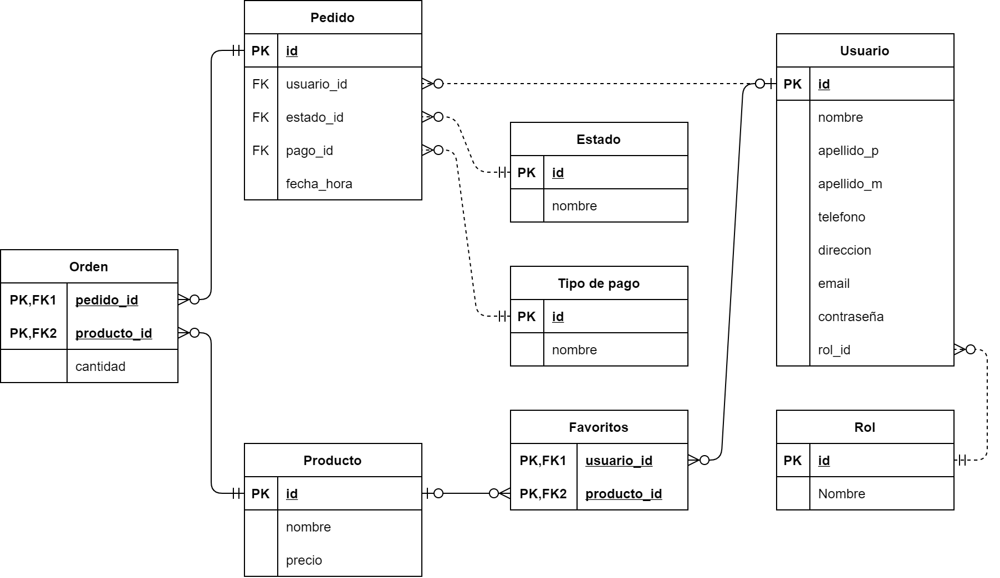

# Delilah Resto

API Rest para restaurante.

## Instrucciones.

1. Es necesario instalar todas las dependencias. Para ello ejecuta el comando `npm install`.
2. Se requiere MySQL/MariaDB, una vez instalado, se deberá proceder a crear la base de datos; para ello se tienen que ejecutar las sentencias de SQL que se encuentran en el archivo `db.sql` dentro de la carpeta `./sql/`. Se recomienda utilizar DBeaver, aunque también es posible ejecutar desde consola.
3. En la raíz deberá modificarse el archivo .env, el cual contiene las configuraciones relacionadas con la base de datos y el token.
   - En `PORT=` deberá especificarse el puerto en el que quiere que se ejecute el servidor; por default es el puerto 3000.
   - En `DB_NAME=` se indicará el nombre de la base de datos; por default es `delilah_resto`, no se recomienda cambiar este campo.
   - En `DB_PASS=` se debe ingresar la contraseña del usuario `root` de la base de datos, esto depende de cómo hayas configurado el SGBD durante la instalación.
   - En `DB_TIMEZONE=` deberá proporcionarse la zona horaria deseada; por default corresponde a la zona horaria de la Ciudad de México: `Etc/GMT-5`.
   - En `TOKEN_SECRET=` se pasará la firma para la generación de tokens. Una vez fijada no deberá modificarse. Por defecto se proporciona la siguiente: `;KE>7C12d>0$"Su`.
4. Se puede ejecutar el servidor de dos maneras: por medio del comando `npm run dev` el cual lo ejecuta en un ambiente para desarrollador por medio de nodemon; así como también por medio del comando `npm start` que lo ejecuta directamente sobre Node.JS. Es recomendable ejecutar por medio de `npm start` en caso de que no se vayan a realizar cambios a los archivos.
5. Con la base de datos creada, el servidor ejecutandose y el archivo .env configurado, lo siguiente es crear el primer usuario. Es importante crearlo por medio del endpoint `/api/v1/users` usando el método POST. Esto se debe a que al crear un nuevo usuario la contraseña es encriptada, por lo que si se crea directamente desde el SGBD no podrá iniciarse sesión posteriormente.
   - Para crear un usuario se requiere pasar por medio de `req.body` un JSON con la siguiente información:
     ```
     {
        "nombre": string,
        "apellido_p": string,
        "apellido_m": string,
        "email": string,
        "pass": string,
        "direccion: "string"
     }
     ```
   - Para más información respecto al formato de cada uno de los campos se proporciona la especificación de la API dentro del archivo `API_Specification.yaml`, este archivo se encuentra en la raíz y puede consultarse por medio de Swagger Editor.
6. Una vez creado el usuario deberá ejecutarse la siguiente sentencia de SQL: `UPDATE users SET rol_id = 2 WHERE id = 1`; esto dará privilegios de administrador al usuario, dándole acceso a los endpoints reservados para administrador. Esta sentencia puede encontrarse dentro del archivo `setAdmin.sql` dentro de la carpeta `./sql`.

## Recursos.

- Se proporciona la especificación de la API en el formato Open API Specification, esta se encuentra en el archivo `API_Specification.yaml`.
- El modelo relacional de la base de datos se encuentra dentro de la carpeta `./sql/`, es una imagen `.png`. Esto ayudará a conocer de mejor manera cómo se encuentra estructurada la base de datos.

## Estructura del proyecto.

- La carpeta `controllers` contiene la implementación de cada uno de los métodos HTTP, mismos que brindan funcionamiento a los distintos endpoints y realizan las sentencias sobre la base de datos.
- La carpeta `database` incluye un archivo de configuración que permite conectar a la base de datos, para ello se utilizan las configuraciones guardadas en el archivo `.env`.
- La carpeta `models` contiene los modelos de Sequelize, estos se utilizan para mapear las respuestas de las sentencias SELECT.
- La carpeta `routes` incluye cada una de las rutas de express, en cada uno de estos archivos es implementan los métodos HTTP para cada uno de los endpoints por medio de express; a su vez, también se manda a llamar las validaciones y las implementaciones de la funcionalidad que se encuentran en la carpeta `controllers`.
- La carpeta `sql` contiene las especificaciones de la base de datos lo que incluye las sentencias de DDL para crear la base de datos, sus tablas y relacionas; así como también los diagramas realizados durante el modelado.
- En la carpeta `utils` se definen métodos o constantes que son utilizados repetidamente dentro de cada uno de los controladores u otros componentes.
- En la carpeta `validation` se definen las validaciones necesarias, de esta manera se corrobora que se está mandando la información necesaria y con el formato indicado a cada uno de los endpoints.
- El archivo `app.js` configura el servidor de express especificando cada una de las rutas, así como también el middleware de body-parser.
- El archivo `index.js` ejecuta el servidor.

## Modelo relacional de la Base de Datos


